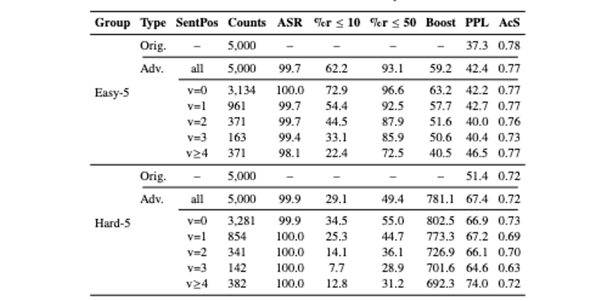
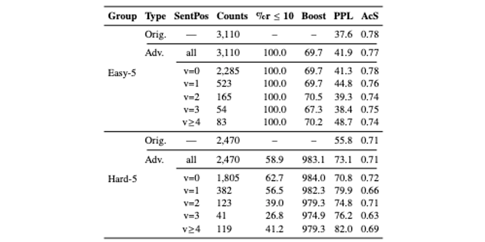
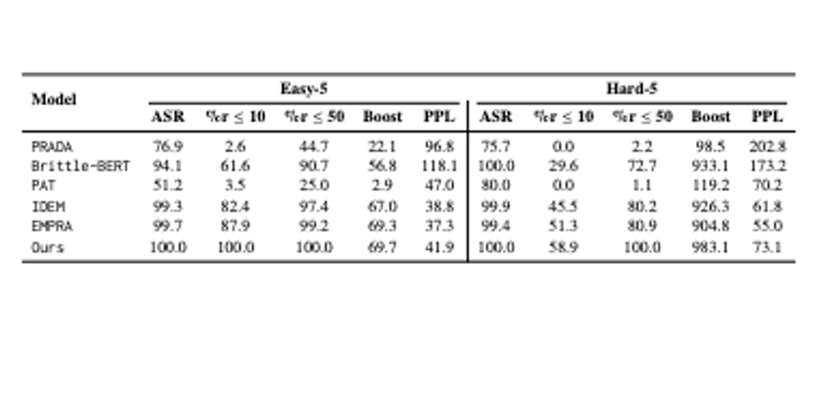

# Datasets for Supervised Adversarial Attacks on Neural Rankers

[](https://www.python.org/) [](http://ansicolortags.readthedocs.io/?badge=latest)


<p align="center"><em>Model Architecture.</em></p>

## Overview

This repository contains the code, datasets, and experimental results associated with our paper:

"Datasets for Supervised Adversarial Attacks on Neural Rankers"

In this paper, we explore adversarial rank attacks on Neural Ranking Models (NRMs) using a structured framework based on Retrieval-Augmented Generation (RAG). Our approach generates adversarial datasets by strategically modifying documents with adversarially generated sentences to manipulate ranking results in Information Retrieval (IR) systems.

To implement our Retrieval-Augmented Generation (RAG) based adversarial dataset construction, we leveraged Qwen3 32B,a state-of-the-art large language model (LLM) optimized for complex language understanding and generation with chain of thoughts. The model was selected due to its strong performance in generating semantically coherent, reasoning, context-aware adversarial modifications while maintaining fluency and linguistic integrity. Below, we outline the key components of our implementation pipeline.

** Please check prompts folder to see our LLM Prompts **

** You can check the datasets in datasets folder **

## Abstract

Neural Ranking Models (NRMs) are vulnerable to adversarial attacks that manipulate document rankings, threatening the integrity of retrieval systems. Existing adversarial attacks rely on unsupervised methods and surrogate models, which limit their generalizability. In this work, we introduce a novel RAG-based dataset construction framework that employs Large Language Models (LLMs) to generate adversarially modified documents optimized for rank manipulation. Our dataset is released in two variations: Gold, and Diamond, categorized by attack effectiveness. The proposed approach facilitates robust evaluation of adversarial resilience in IR systems and the development of defense strategies against ranking attacks.

## Key Contributions

- A supervised adversarial dataset for benchmarking adversarial attacks against NRMs.
- An iterative self-refinement process using an LLM-NRM feedback loop to generate high-impact adversarial modifications.
- Two dataset variations (Gold, Diamond) categorized by ranking impact.
- Comprehensive evaluation against state-of-the-art adversarial attack methods on IR systems.

## Installation
To set up the project environment, run the following:

```
conda create -n rag_attack_env python=3.10
conda activate rag_attack_env
pip install -r requirements.txt
```

## Run
To run the code, you can use main_no_think_v2.py for no reasoning LLM. It will save the result on output folder. 
Then you can run main_think_v2.py that will run the reasoning LLM for those query-documents that did not achieve the goal.


## Source Data
Following Wu et al., we evaluate our attack methods on a randomly sampled subset of 1,000 queries from the Dev set. For each query, we target two distinct types of documents—Easy-5 and Hard-5—selected from the re-ranked results produced by the victim neural ranking model (NRM) after applying it to the top-1K BM25 candidates. This dual-target approach allows us to systematically assess the impact of our rank boosting techniques on documents with varying levels of initial ranking quality.

## Target Document Groups
- Easy-5: This group consists of five documents initially ranked between positions 51 and 100 in the search results. Specifically, one document is randomly sampled from every ten-ranked positions within this range (e.g., ranks 51, 63, 76, 84, and 91). By targeting these mid-ranked documents, we aim to evaluate how our augmentation strategies enhance the visibility of documents that are neither highly ranked nor too obscure.
- Hard-5: In contrast, this group comprises the five lowest-ranked documents from the re-ranked list, representing the most challenging cases for rank boosting. By focusing on these least visible documents, we critically examine the robustness of our augmentation approach when applied to content with minimal initial exposure.

## Datasets Variation
Our datasets are categorized as follows:
- Gold: Selects the best-performing adversarial modifications per document-query pair.
- Diamond: Strictly filters cases where documents achieve a rank of ≤10 for mid-ranked (Easy-5) and ≤50 for lower-ranked (Hard-5) documents.


## Attack Performance Evaluation Metrics
- Attack Success Rate: The percentage of cases where the target document’s rank improves following augmentation.
- %r ≤ 10: The proportion of documents that achieve a final ranking within the top 10 results, indicating a high level of retrieval performance.
- %r ≤ 50: The proportion of documents that move to rank 50 or better, providing insight into broader ranking improvements.
- Boost: The average rank increase for the document post augmentation, quantifying the magnitude of improvement.
- Adv Rank: The final average rank of the document after augmentation, serving as a summary measure of the method’s overall effectiveness.
- Perplexity: A measure of text fluency, with lower values indicating more predictable and coherent language after augmentation.
- Acceptability Score: A measure of perceived text quality, reflecting how natural or readable the augmented document is compared to the original document.

## Table 1: Gold Dataset statistics over Easy-5 and Hard-5.


<p align="center"><em></em></p>

## Table 2: Diamond Dataset statistics over Easy-5 and Hard-5.


<p align="center"><em></em></p>


## Table 3: Performance comparison across baselines and ours.
We evaluate our approach against state-of-the-art adversarial ranking techniques, including:
- Query Injection (Query+)
- Embedding Perturbation (EMPRA)
- Trigger-Based Attacks (PAT, Brittle-BERT)
- Sentence-Level Attacks (IDEM)


<p align="center"><em></em></p>


